# 게임 리뷰 데이터를 활용한 유저 감성 및 이슈 분석

---

## 1. 서론

최근 게임 산업에서는 Steam 및 다양한 커뮤니티를 중심으로 대규모 리뷰 데이터가 지속적으로 축적되고 있다. 이러한 리뷰 데이터는 유저의 실제 플레이 경험과 만족도가 직접적으로 반영된다는 점에서 중요한 분석 대상이다. 그러나 리뷰 데이터는 비정형 텍스트 형태로 존재하기 때문에, 단순 통계만으로는 유의미한 인사이트를 도출하기 어렵다.

본 프로젝트는 자연어 처리(NLP) 기법을 활용하여 게임 리뷰 데이터를 **감성(긍정/부정)** 과 **토픽(기술/스토리/플레이)** 관점에서 분석하는 것을 목표로 한다. 이를 통해 게임별로 유저들이 어떤 요소를 긍정적 또는 부정적으로 인식하는지 파악하고, 리뷰 데이터가 게임 분석에 활용 가능한 정량적 지표임을 확인하고자 한다.

본 연구의 분석 대상 게임은 다음 4종이다.

* 발더스 게이트 3
* 엘든 링
* 몬스터 헌터 와일즈
* 나 혼자만 레벨업: 어라이즈

원래 출시 후 1개월 이상 지나지 않은 게임은 하지 않으려 했으나 부정적인 리뷰가 많은게임이 적어 추가 하게되었다 

---

## 2. 데이터 수집

### 2.1 데이터 수집 방법

리뷰 데이터는 Steam api를 활용해 크롤링 하였다.

수집된 주요 항목은 다음과 같다.

* 리뷰 본문 텍스트
* 추천 여부(긍정/부정)
* 플레이타임
* 유용함 수(helpful)

※ 실제 리뷰 원문 데이터는 저작권 이슈로 인해 Github에 업로드하지 않았으며, 데이터 수집 로직이 구현된 `crawling.py` 코드는 공개하였다.

> **크롤링 구조**
>
> * 4개를 총 25000개를 타겟으로 약 6300개씩 추출

---

## 3. 데이터 라벨링 과정

본 프로젝트에서는 리뷰 데이터를 다음 기준으로 라벨링하였다.

  * 기술(0): 버그, 최적화, 성능, 시스템 오류 등
  * 스토리(1): 세계관, 서사, 캐릭터, 연출 등
  * 플레이(2): 전투, 조작, 콘텐츠, 게임성 등

라벨링은 openai api 를 사용 
모델은 gpt-4o-mini를 사용

사용한 프롬프트
>너는 게임 리뷰 데이터를 보고 유저가 평가를 내린 '가장 결정적인 원인'을 분류하는 AI야.\
아래 리뷰 텍스트를 읽고, 기준에 맞춰 0, 1, 2 중 하나로 분류하고 그 이유를 요약해줘.\
[분류 기준]\
0 (기술/환경): 최적화, 렉, 프레임 드랍, 버그, 튕김, 서버 불안정, 발열, 사양 문제, 실행 불가\
1 (콘텐츠/스토리): 스토리, 서사, 연출, 더빙(성우), 그래픽(심미적), OST, 분위기, 몰입감, 원작 재현\
2 (플레이/시스템): 전투, 타격감, 난이도, 조작감, UI/UX, 밸런스, 파밍, 과금(BM), 재미, 시스템\
반드시 아래 JSON 포맷으로만 출력해:\
{ \
  "category_id": 0, \
  "reason_keyword": "최적화 문제", \
  "summary": "최적화가 엉망이라 게임 진행이 불가능함" 

---

## 4. 데이터 전처리 및 학습 탐색적 데이터 분석(EDA)

### 4.1 데이터 구성

최종 분석에 사용된 데이터는 `final_result_4games.csv` 파일로, 약 25,000건의 리뷰로 구성되어 있다.

| 컬럼명       | 설명                 |
| --------- | ------------------ |
| game      | 게임명                |
| text      | 리뷰 본문              |
| Sentiment | 감성 분류 (긍정/부정)      |
| Topic     | 토픽 분류 (기술/스토리/플레이) |
| playtime  | 플레이 시간             |
| helpful   | 유용함 수              |

### 4.2 데이터 분포 분석

리뷰 데이터의 기본적인 특성을 파악하기 위해 토픽 분포와 감성 비율을 시각화하였다.

> **전체 리뷰 주제 분포**
>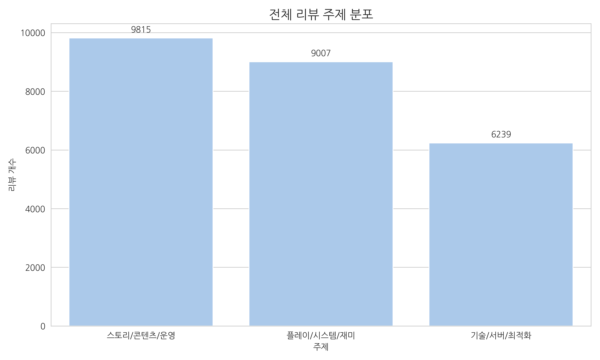

전체 리뷰에서 스토리 관련 토픽의 비중이 가장 높게 나타났으며, 이는 유저들이 스토리 및 콘텐츠 운영을 가장 중요하게 인식하고 있음을 의미한다.

>  **주제별 긍정/부정 반응 비교**
>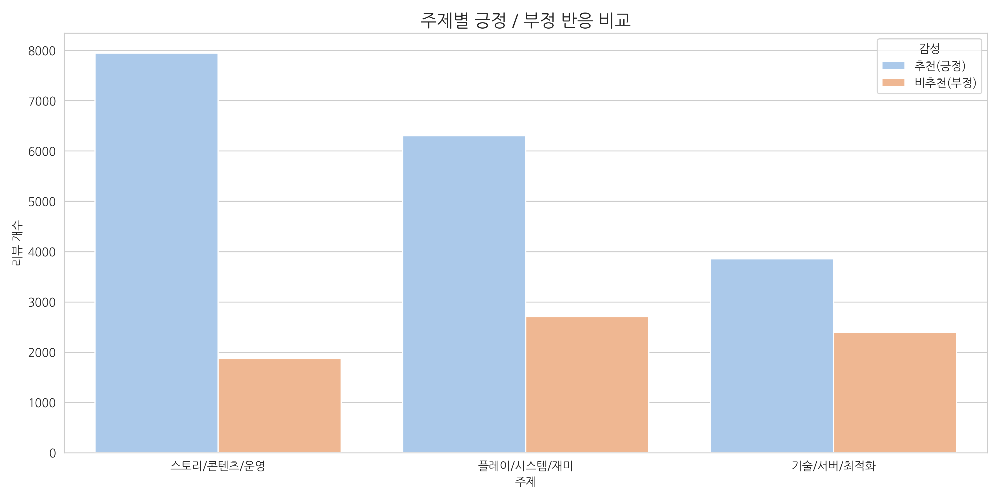

기술 토픽에서는 긍정 감성 비율이 상대적으로 높게 나타났다.

### 4.3 플레이타임 분석

감성에 따른 플레이타임 분포를 분석한 결과, 긍정 리뷰를 작성한 유저의 평균 플레이타임이 더 높은 경향을 보였다.

하지만 최근에 나온 게임인 나 혼자만 레벨업은 평가가 좋지 않아 부정 리뷰에서의 플레이타임이 높게 나타난다. 이러한 특성으로 인해 출시 이후 최소 1개월 이상이 경과한 데이터가 분석에 보다 중요하다고 볼 수 있다.
>**게임별 긍정/부정 리뷰어의 플레이 타임 비교**
>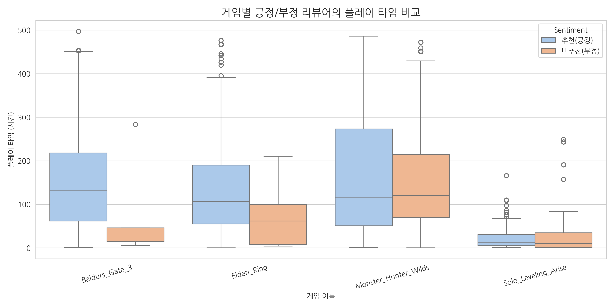

---

## 5. 게임별 이슈 분석 결과

게임별로 어떤 토픽이 주요 이슈로 작용하는지를 확인하기 위해 히트맵 분석을 수행하였다.

> **게임별 주제 언급 빈도**
>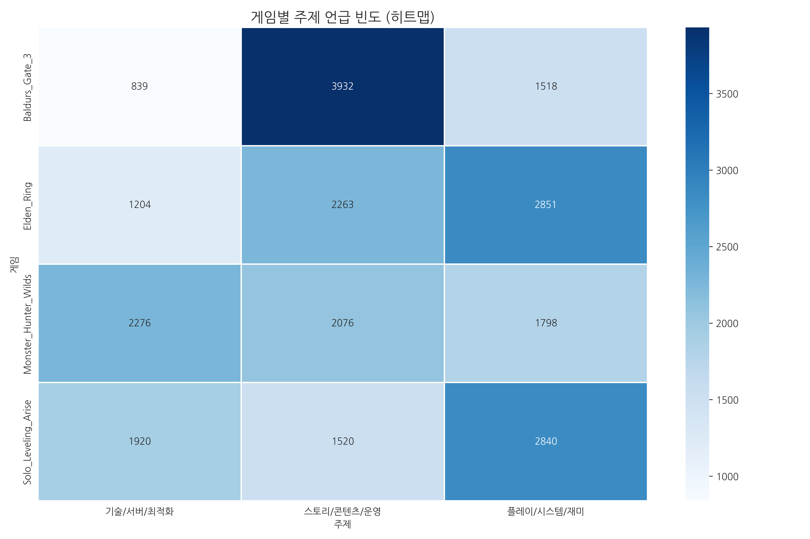

히트맵 결과, 게임별로 강조되는 토픽이 명확히 구분되었으며 각 게임의 강점 또는 문제 영역을 직관적으로 확인할 수 있었다.

---

## 6. 키워드 분석 (워드클라우드)

리뷰 텍스트에서 자주 등장하는 핵심 키워드를 분석하기 위해 워드클라우드 기법을 사용하였다. 형태소 분석기는 KoNLPy 환경 이슈로 인해 **kiwipiepy(Kiwi)** 를 사용하였으며, 명사(NNG, NNP)만을 추출하고 불용어를 제거하였다.

게임별로 긍정 및 부정 리뷰를 구분하여 워드클라우드를 생성함으로써, 감성에 따른 언어적 차이를 비교하였다.

> 발더스 게이트 3 긍정 \
> 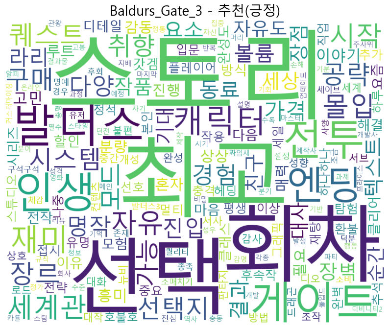\
> 발더스 게이트 3 부정\
> 

> 엘든링 긍정\
> 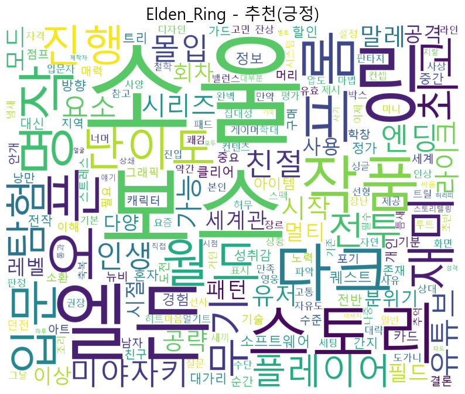\
> 엘든링 부정 \
> 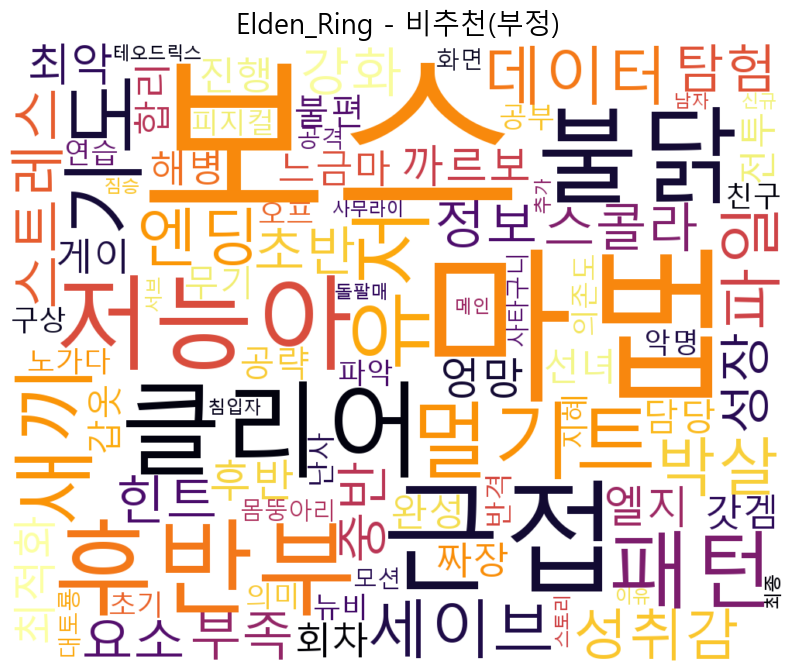

> 몬스터 헌터 와일즈 긍정\
> 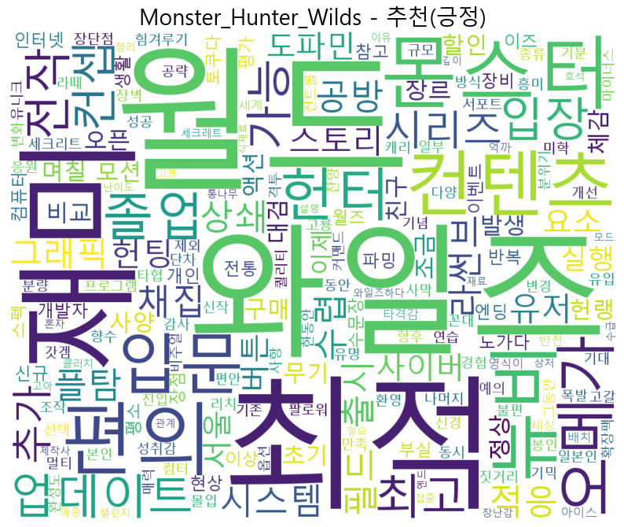\
> 몬스터 헌터 와일즈 부정\
> 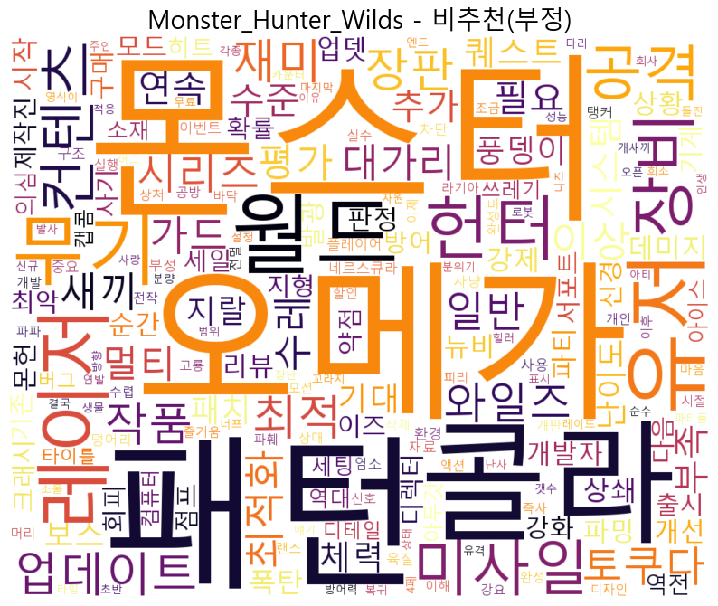

> 나 혼자만 레벨업:어라이즈 긍정\
> 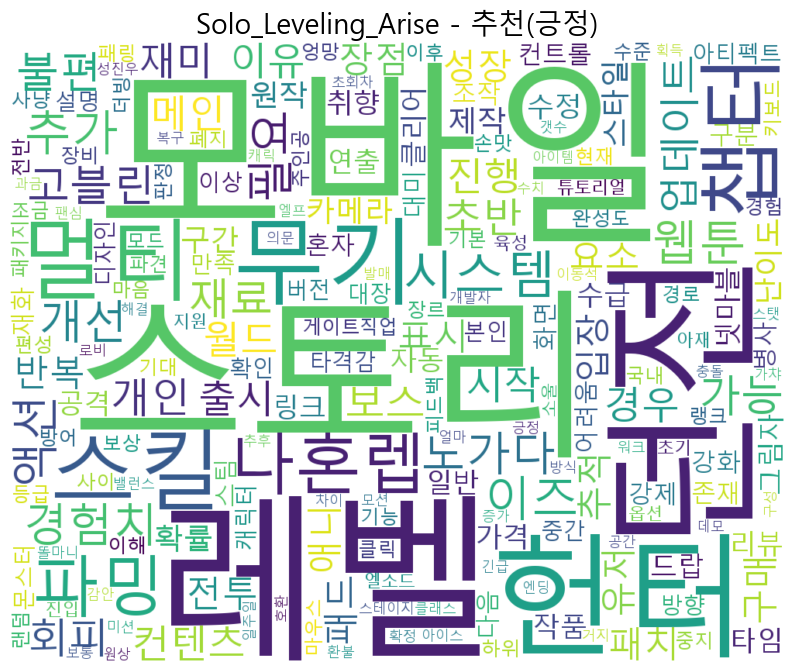\
> 나 혼자만 레벨업:어라이즈 부정\
> 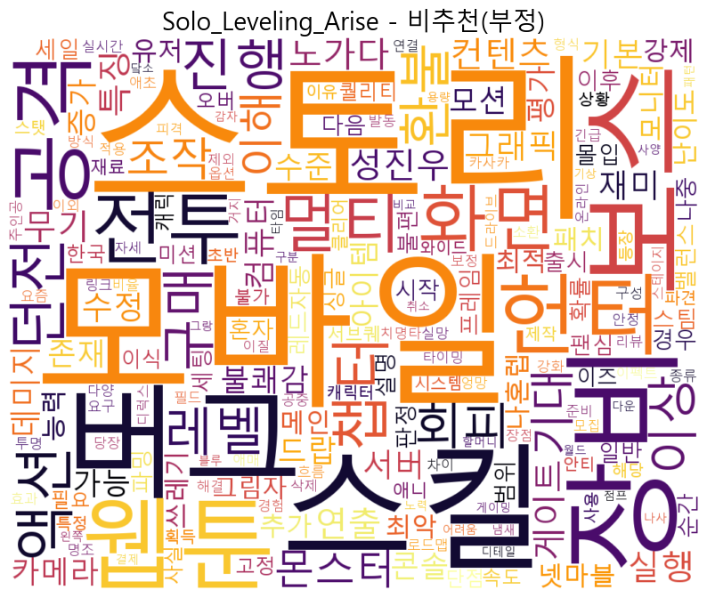

긍정 리뷰에서는 몰입, 재미, 연출과 같은 감성적 키워드가 주로 등장한 반면, 부정 리뷰에서는 버그, 최적화, 오류 등 기술적 문제를 나타내는 단어가 두드러졌다.

---

## 7. 모델 

본 프로젝트에서는 한국어 리뷰 텍스트의 특성을 효과적으로 반영하기 위해 사전 학습된 언어 모델인 KoELECTRA (monologg/koelectra-base-v3-discriminator) 를 기반으로 분류 모델을 구성하였다. KoELECTRA는 한국어 자연어 처리 태스크에서 우수한 성능을 보이는 모델로, 비교적 적은 학습 자원으로도 안정적인 분류 성능을 확보할 수 있다는 장점이 있다.

본 연구에서는 KoELECTRA 모델 위에 분류 레이어를 추가하여 리뷰 텍스트를 입력으로 받아 감성(긍정/부정) 및 토픽(기술/스토리/플레이) 정보를 예측하도록 설계하였다.

데이터는 다음과 같은 기준으로 활용하였다.

>  -학습 데이터: 모델 파라미터 학습에 사용\
>  -검증 데이터: 학습 과정 중 모델 성능 확인에 사용

---

>  **검증 정확도 그래프**
>

---

## 8. 결론

본 프로젝트에서는 게임 리뷰 데이터를 기반으로 유저 감성과 주요 이슈를 감성 및 토픽 관점에서 분석하였다. 분석 결과, 유저 평가는 플레이 경험과 기술적 완성도에 크게 의존하며, 게임별로 서로 다른 이슈 구조가 존재함을 확인하였다.

본 연구는 리뷰 데이터가 게임 분석 및 사용자 경험 연구에 있어 유의미한 데이터 자원이 될 수 있음을 보여준다.

---

